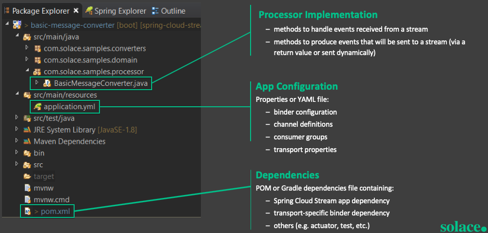
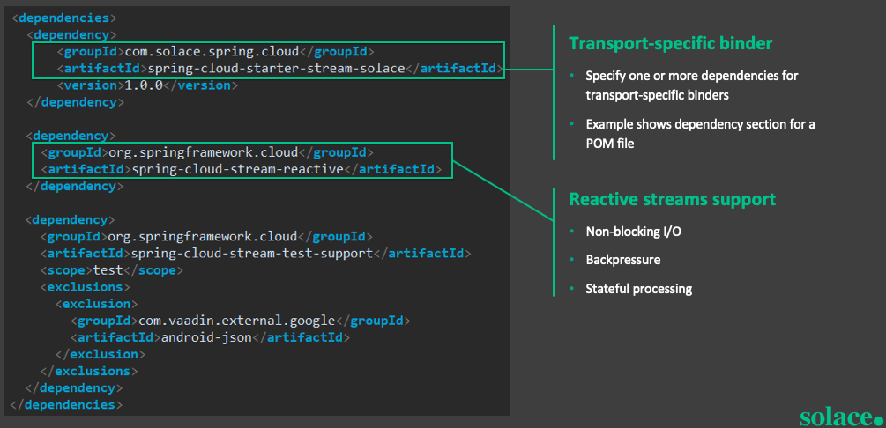
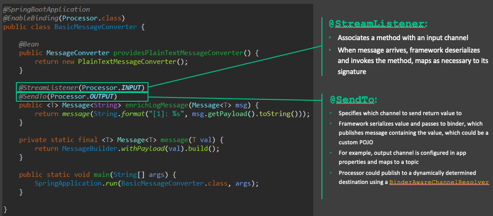
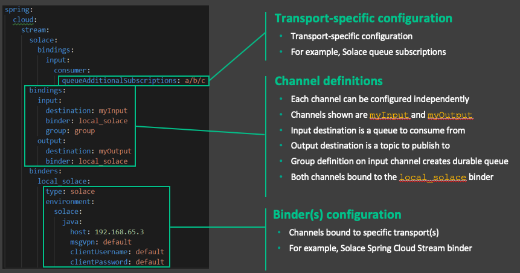

author: Marc DiPasquale
summary: Using Spring Cloud Streams w/ Solace PubSub+
id: solace-codelab-scs-1
categories: spring,scs,cloud-streams,solace,pubsub+,java,pcf,openshift
environments: Web
status: draft
feedback link: github.com/Mrc0113/solace-workshop-scs
analytics account: 0

# Developer Workshop: Using Spring Cloud Streams with Solace PubSub+

## CodeLab Overview
Duration: 0:10

Using Java & Spring Cloud Streams (SCS) to create Event-Driven Applications with PubSub+
* The purpose of this codelab is to introduce java developers to creating event-driven applications with Spring Cloud Streams and PubSub+
* “Spring Cloud Stream is a framework for building highly scalable event-driven microservices connected with shared messaging systems."
* It is based on Spring Boot, Spring Cloud, Spring Integration and Spring Messaging

You're a developer that works for an up and coming car company named Edison Automotives. Your boss is not the most adept in the use of social media but he's been hearing great things about twitter from his inner-circle and is a bit infatuated with tying it into Edison Automotive's every day business and culture....little does he know that his company does not exactly have the best products or reputation....

**INSERT INTRO STORY** 
**INSERT DIAGRAM?**

Positive
: **Developer Resources** 
Spring Cloud Stream Project Home: [https://spring.io/projects/spring-cloud-stream](https://spring.io/projects/spring-cloud-stream) 
The latest GA version of Spring Clouds Streams as of the creation of this lab is Fishtown SR2. 
The Reference Guide for that version is available [here](https://cloud.spring.io/spring-cloud-static/spring-cloud-stream/2.1.2.RELEASE/single/spring-cloud-stream.html).

Negative
: The SCS framework allows for building messaging-driven applications without having to explicitly write any code for publishing or receiving events.  While many microservices-oriented applications today are based on synchronous, request/response interactions based on protocols such as HTTP or gRPC, the asynchronous, event-driven nature of communications using SCS allows for building highly scalable, efficient and responsive distributed systems that can run on-premise or in the cloud.  When combined with the high-performance Solace PubSub+ Event Broker which can be deployed in virtually any environment, you can create powerful and flexible applications that support both hybrid and multi-cloud capabilities, all operating in real-time with high throughput and low latency. 

## Set-up & Prerequisites
Duration: 0:10

<INSERT INFO FROM DOC THAT HEINZ CREATED>
### Developer IDE & Code Access
#### IDE Setup
The recommended IDE for the workshop is Spring Tools Suite (STS). STS comes with some niceties, such as autodeploy, when used with spring-boot-devtools. Participants can of course use another IDE if preferred. It is also recommended that you begin the workshop with an empty STS workspace to avoid any unforeseen issues with existing projects/configurations/code.  

Required libraries: 
* Use the latest JDK 1.8 (ensure your PATH & JAVA_HOME are updated as needed)
* Maven 3.5.3 or higher (ensure it's on your PATH)

#### Code Access
* Clone the github repo **TODO - Add real repo & branch info**
```bash
$ git clone git@github.com:Mrc0113/solace-workshop-scs.git
```
* Import the projects into STS
In STS, use the File -> Open Projects from File System … option to load the workshop template projects from the Solace GitHub repository (URL will be provided by the instructor).  The full solution for the workshop is also provided for your reference in case you fall behind or encounter issues.  Throughout the workshop exercises, specific instructions are provided to perform tasks such as implement code or configuration.  Students are encouraged to attempt a resolution on their own before using the recommended solution.

The following projects are provided in the template directory and should be loaded into STS: **Add projects**

Negative
: Note:  There will be errors associated with the template projects as they are incomplete and will be addressed in the exercises that follow.

**Add steps to setup a cloud foundry target**

**Maybe add step to build common project here?  Is this necessary?**

### Create and/or Verify access to a Solace PubSub+ Access

#### PubSub+ Service in Solace Cloud
If you want to stand up your Solace PubSub+ Service in Solace Cloud login or signup at the [Cloud Signup Page](https://console.solace.cloud/login/new-account)

#### Local Solace PubSub+ Instance
When developing your application, you may want to test using a local instance of the Solace PubSub+ Event Broker.  Refer to the Solace [Docker Getting Started Guide](https://solace.com/software/getting-started/) to get you up and running quickly with a broker instance running in Docker.  You may skip this step if you decide to use a broker running in PCF or Solace Cloud.

#### Solace PubSub+ Service in Pivotal Cloud Foundry (PCF)
If you are using PCF, your administrator will have created an org and space for your workshop demo in which you can deploy and run your microservices.  Moreover, a Solace PubSub+ service instance will have been created so that it can be bound by any app running in the space and automatically lookup credentials to connect to a broker instance running in PCF.  You should determine the name of this service instance before deploying or running your application to avoid any service binding errors.  You can do this through the Apps Manager or via the cf CLI. 

```bash
$ cf services 
Getting services in org test-org / space development as user1... 
name                    service             plan                       bound apps  
solace-pubsub-service   solace-pubsub       Enterprise Shared Plan     sample-app 
```

#### Solace PubSub+ Service in OpenShift
<INSERT>

## Section 1 - Deploy Your First Source & Sink
Duration: 0:20

* Boss - The marketing department wants to use the tweets to learn more about our customer’s thoughts.  Since you’re already getting them can you share them with marketing?
* Developer - That’s Possible!  Tell them to give me a call!

Negative
: SCS Provides 3 Binding Interfaces:
1 Sink - "Identifies the contract for the message consumer by providing the destination from which the message is consumed."
2 Source - "Identifies the contract for the message producer by providing the destination to which the produced message is sent."
3 Processor - "Encapsulates both the sink and the source contracts by exposing two destinations that allow consumption and production of messages."

### Deploying a Source

Before our company can do anything with the tweets we have to start to receive an incoming stream of them!  Let's get started! Please navigate to the "scs-source-tweets" project in your IDE.

#### Learn the Project Structure
Before we take a look at the code, let's take a quick look at the structure of a Spring Cloud Streams project.  

* As a java developer you'll probably see a familiar project setup. You have your main application under src/main/java and unit tests under src/test/java.



Negative
: Spring Cloud Streams is built on top of Spring Boot. A great resource for creating your own Spring Boot applications is Spring Initializr. A publically hosted version is hosted here: [start.spring.io](https://start.spring.io)

* Next go ahead and open up the pom.xml file in your "scs-source-tweets" project and search for "binder"; you should have found the "spring-cloud-stream-binder-solace" which is what is going to allow SCS to connect to Solace PubSub+


**TODO UPDATE DIAGRAM BELOW**


* Let's take a look at a simple sample implementation in the image below. You can see that the enrichLogMessage method is associated with both an INPUT and OUTPUT channel. In a future section we will create an application following a similar pattern, but notice that if you look at the *ScsSourceTweets.java* class in your "scs-source-tweets" project you will see something a bit different. We are using an *@InboundChannelAdapter* annotation in order to create tweets at a fixed rate. 

Negative
: "Spring Cloud Stream is built on the concepts and patterns defined by Enterprise Integration Patterns and relies in its internal implementation on an already established and popular implementation of Enterprise Integration Patterns within the Spring portfolio of projects: Spring Integration framework." By using Spring Integration we can make use of familiar annotations such as *@InboundChannelAdapater, @Transformer or @ServiceActivator*



* One last thing to look at and then we'll deploy your first source! Go ahead and open your application.yml file. This file holds the bindings that tells the SCS binder how to connect your input/output channels to the specified middleware at runtime.  



Positive
: SCS apps are not restricted to only using one binder at a time. This allows a SCS app the flexibility of receiving events from one binder/location/environment/etc, performing business logic and then sending new events to another binder/location/environment/etc. 
**TODO think of Kafka to Solace example here**
Also note that because bindings are dynamically configured at run-time you don't have to touch the code to switch out your binder of choice, environment info, etc. 

#### Deploy our scs-source-tweets app
* First open the *application.yml* file and update the host, msgVpn, clientUsername & clientPassword to match your PubSub+ environment. When obtaining the connect info note that the SCS solace binder uses the Solace Java API with the SMF protocol.
* If using STS, start the app by right clicking on the project and choosing "Run As" -> "Spring Boot App"
* If not using STS, open a cli and navigate to the project's directory and then run 
```bash
mvn spring-boot:run
```
* Whichever way you started the app you should see the app start, connect and begin to send tweets by looking at the console.

Developer - Awesome! Now we have a stream of tweets coming in! 
Developer - As marketing requested we just need to capture them so they can perform their analytics.
To do this we will deploy a sink app.  Recall that a sink app binds to an INPUT channel. 

### Deploying a Sink
* Open the "scs-sink-analytics" project 
* Take a look at the code in the *ScsSinkAnalytics.java* class; you'll notice we have a very simple class with only a few methods. As we saw earlier, the *@StreamListener* attribute identifies which channel our *sink* method will receive events from. Also notice that the sink method is expecting a POJO tweet parameter of type *Tweet*

Negative
: TODO - include snippet that talks about json under the covers but converts to java object.

* Now update the *application.yml* file for the "scs-sink-analytics" project with the same info that you used when deploying the source app.
* Time to deploy!  Deploy the "scs-sink-analytics" app the same way you started "scs-source-tweets"
* Now that your sink is started you should see it logging the tweets as they come in! 

Developer - Woohoo! We've deployed our first SCS source and sink applications and the marketing department is now getting the stream of tweets as they requested! Time to give our boss the good news.

Positive
: You now have a source application sending events to a sink application via an external eventing system, but notice that you didn't need to use any messaging APIs! SCS provides this abstraction and makes it possible for developers to concentrate on their business logic rather than learning proprietary messaging APIs!


## Section 2 - Discover the ease of 1-to-Many with Publish-Subscribe
Duration: 0:05

* Hey Tweet Master, I’m loving this twitter thing my buddy told me about!  I want our LED ribbon around the factory floor to become a “Tweet Board” and show all the tweets about our awesome vehicles. The factory team members are going to love it!
* That’s Possible!  I’ll get right on it – give me an hour.

<INSERT TECHNICAL STEPS>
Create Factory Tweet Board [ Attendees w/ instructor ]

Positive
: Notice that the publisher (Source) application did not need to be modified in order for another consumer (Sink) application to receive the stream of tweets. There are two takeaways here: 
1 The publish-subscribe paradigm allows for the publisher to send data once and not care whether 0,1,2 or 100 applications are subscribed on the other end. It just send the data and moves on. 
2 Developing event driven applications allows for decoupling of your sending and receiving applications. This powerful concept allowed our company to add new functionality without touching our already operational applications. 

## Section 3 - Creating your first Processor
Duration: 0:15

* Hey Tweet Master, I’ve got a problem with your work!  This twitter board is letting employees take credit for all the customer’s ideas.  I want to send the new feature tweets to my private page instead of the “Tweet Board.” Can you fix it?
* That’s Possible! I’ll do it right away – should be ready in 30 minutes.

<INSERT TECHNICAL STEPS>
Create Boss Sink [ Instructor]
Create Features Processor [Instructor]

Positive
: Notice that you created a custom processor binding to support multiple outputs since the default Processor binding only has one input and one output. 

## Section 4 - Painless Multi-protocol with MQTT
Duration: 0:10

* Good job “Tweet Master!”  Now everyone is looking at me like the genius I am.  Look at all those amazing tweets coming through.  Unfortunately only the people in the factory can see them.  Can you create a webpage so people in the offices can see them too? 

<INSERT TECHNICAL STEPS>
Creates MQTT Web App [ Instructor]

Positive
: Shows multi-protocol (Solace made that easy)

## Section 5 - Chain Multiple Processors Together
Duration: 0:10

* Hey Tweet Master – we’re still receiving a bunch of complaints and negative tweets…I’m looking like an idiot here.  Fix it now!  And while you’re at it create some upbeat positive tweets!  I don’t want people seeing our cars break down or catch on fire and explode! 

<INSERT TECHNICAL STEPS>
Attendees [along with instructor] create “Negative to Positive” processor
Students get a list of words that need to be changed..
("on fire”, "broken down”, “crashed”, “explosion”, “sucks”)


Positive
: Notice that multiple processors can easily be connected together in order to form a processing chain. 

## Section 6 - Review & Continue Learning!
Duration: 0:05

* Looks good “Tweet Master!” Now I can watch the tweets form my corner office! Take the rest of your day off and go get yourself a drink! 

<INSERT TECHNICAL STEPS>

## Markdown Syntax Backup
Duration: 0:01

``` Java
public static void main(String args[]){
  System.out.println("Hello World!");
  }
```

Positive
: This will appear in a positive info box.

Negative
: This will appear in a negative info box.

 [Download SDK](https://www.google.com)

Adding an image


